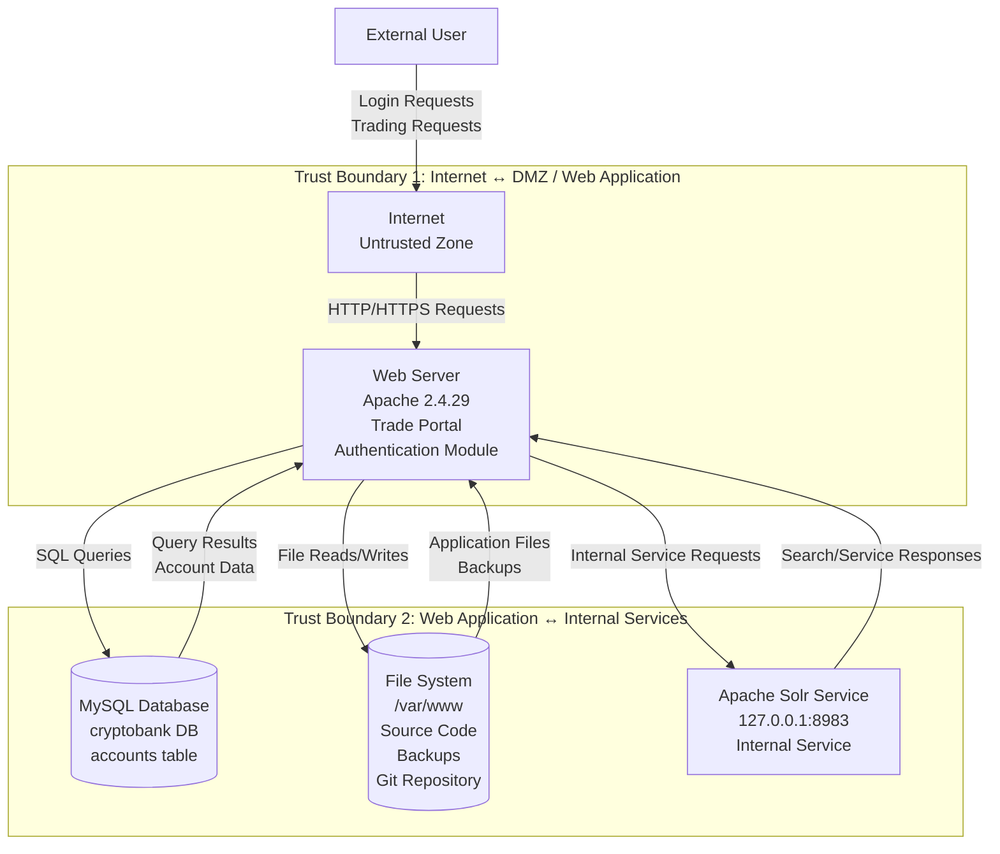

# Threat Modeling & Risk Assessment of the CryptoBank Trading Platform

## Overview

This lab focuses on performing a comprehensive threat modeling and risk assessment exercise for the **CryptoBank Trading Platform**, a vulnerable banking-style web application previously assessed during Lab 01.

Unlike penetration testing, which identifies vulnerabilities through active exploitation, this phase evaluates the system from a **secure design and application security architecture perspective**. The goal is to identify weaknesses early in the Software Development Lifecycle (SDLC), understand how threats could impact critical assets, and recommend defensive controls before attackers can exploit the system.

The assessment uses:

- Data Flow Diagrams (DFDs)
    
- STRIDE threat modeling
    
- DREAD risk scoring
    
- NIST SP 800-53 control mapping
    
- OWASP ASVS control alignment
    
- Secure SDLC analysis
    

---

## Objectives

The primary objectives of this lab were to:

- Develop a system-level Data Flow Diagram for the CryptoBank application.
    
- Identify external entities, processes, data stores, and trust boundaries.
    
- Analyze application threats using the STRIDE framework.
    
- Prioritize risks using the DREAD scoring model.
    
- Map identified threats to NIST SP 800-53 and OWASP ASVS controls.
    
- Recommend secure design and implementation improvements.
    
- Demonstrate how threat modeling supports Application Security and SSDLC programs.
    

---

## Assessment Methodology

The threat modeling exercise followed a structured security architecture review process:

```text
System Decomposition
        ↓
Asset Identification
        ↓
Data Flow Mapping
        ↓
Trust Boundary Identification
        ↓
STRIDE Threat Analysis
        ↓
DREAD Risk Scoring
        ↓
Security Control Mapping
        ↓
Remediation Planning
```

---

## System Overview

The CryptoBank Trading Platform represents a web-based financial application that supports user authentication, trading-related workflows, account management, and interaction with backend services.

The application architecture includes:

- External users
    
- Internet-facing web server
    
- Authentication module
    
- MySQL database
    
- File system resources
    
- Internal Apache Solr service
    
- Development and administrative resources
    

Because the platform handles sensitive financial and authentication data, secure design controls are critical.

---

## Data Flow Diagram

The following Data Flow Diagram represents the logical architecture of the CryptoBank Trading Platform and highlights major trust boundaries, sensitive data flows, and high-value backend components.



---

## DFD Component Breakdown

### External Entity: External User

The external user represents unauthenticated or authenticated users interacting with the CryptoBank application through a browser.

#### Security Concerns

- Credential theft
    
- Account takeover
    
- Session hijacking
    
- Malicious input submission
    
- Unauthorized access attempts
    

---

### Process: Web Server

The web server hosts the CryptoBank Trading Platform and handles user requests, authentication, business logic, and backend communication.

#### Security Concerns

- SQL Injection
    
- Authentication bypass
    
- Broken access control
    
- Command injection
    
- Insecure development endpoints
    
- Sensitive information disclosure
    

---

### Data Store: MySQL Database

The database stores sensitive application data including user accounts, credentials, and financial information.

#### Security Concerns

- Unauthorized data extraction
    
- Database tampering
    
- Credential exposure
    
- Excessive database privileges
    
- Lack of query parameterization
    

---

### Data Store: File System

The file system contains application source code, backups, development files, and potentially exposed repositories.

#### Security Concerns

- Source code disclosure
    
- Backup leakage
    
- Configuration exposure
    
- Git repository disclosure
    
- Local file inclusion risks
    

---

### Internal Service: Apache Solr

Apache Solr operates as an internal backend service and may support application search or indexing functionality.

#### Security Concerns

- Internal service exploitation
    
- Privilege escalation
    
- Remote code execution
    
- Lateral movement after web compromise
    

---

## Trust Boundary Analysis

### Trust Boundary 1: Internet → Web Application

This boundary separates untrusted external traffic from the application layer.

#### Primary Threats

- Spoofing
    
- Tampering
    
- Information Disclosure
    
- Denial of Service
    

#### Security Requirements

- Enforce TLS
    
- Validate all user input
    
- Implement secure authentication
    
- Protect session tokens
    
- Apply rate limiting
    
- Deploy WAF protections
    

---

### Trust Boundary 2: Web Application → Internal Services

This boundary separates the public-facing web application from sensitive backend systems.

#### Primary Threats

- SQL Injection
    
- Privilege escalation
    
- Unauthorized database access
    
- Internal service abuse
    
- File system compromise
    

#### Security Requirements

- Enforce least privilege
    
- Segment internal services
    
- Use service-level authentication
    
- Apply database access controls
    
- Restrict filesystem permissions
    
- Monitor backend access patterns
    

---

## Critical Assets

|Asset|Classification|Business Impact|
|---|---|---|
|User Credentials|Confidential|Account takeover and credential reuse|
|Financial Records|Highly Confidential|Fraud, data breach, compliance impact|
|Account Data|Confidential|Privacy violations and reputational damage|
|Source Code|Internal|Vulnerability discovery and IP exposure|
|Database Credentials|Restricted|Full backend compromise|
|Internal Services|Restricted|Privilege escalation and lateral movement|

---

## Critical Data Flows

|Data Flow|Description|Security Requirement|
|---|---|---|
|User → Web Application|Login and trading requests|Authentication, TLS, input validation|
|Web Application → Database|SQL queries and account lookup|Parameterized queries, least privilege|
|Database → Web Application|Account and credential data|Confidentiality and access control|
|Web Application → File System|Reads application and backup files|Authorization and integrity controls|
|Web Application → Solr|Internal service communication|Service authentication and segmentation|

---

## STRIDE Threat Analysis

The STRIDE methodology was used to identify threats against the system architecture.

---

# Spoofing

Spoofing occurs when an attacker impersonates a legitimate user, service, or system component.

## Threat S1: Credential-Based User Impersonation

### Scenario

An attacker obtains valid user credentials through phishing, credential stuffing, weak authentication, or database compromise and uses them to impersonate a legitimate CryptoBank user.

### Impact

- Unauthorized account access
    
- Fraudulent transactions
    
- Loss of customer trust
    
- Compliance violations
    

### Mitigations

- Enforce Multi-Factor Authentication
    
- Implement login rate limiting
    
- Detect credential stuffing attempts
    
- Use secure password storage
    
- Monitor anomalous login behavior
    

### Control Mapping

|Framework|Control|
|---|---|
|NIST SP 800-53|IA-2 Identification and Authentication|
|OWASP ASVS|V2 Authentication|

---

## Threat S2: Basic Authentication Over Unencrypted Channel

### Scenario

Credentials transmitted over HTTP or weakly protected channels may be intercepted by attackers performing man-in-the-middle attacks.

### Impact

- Credential disclosure
    
- Account takeover
    
- Session compromise
    

### Mitigations

- Enforce HTTPS site-wide
    
- Disable Basic Authentication over HTTP
    
- Implement HSTS
    
- Use secure cookie flags
    
- Reject plaintext authentication traffic
    

### Control Mapping

|Framework|Control|
|---|---|
|NIST SP 800-53|SC-8 Transmission Confidentiality|
|OWASP ASVS|V2.5 Credential Security|

---

# Tampering

Tampering occurs when an attacker modifies data, requests, files, or system behavior.

## Threat T1: SQL Query Manipulation

### Scenario

An attacker injects malicious SQL syntax into authentication or trading parameters, modifying backend database queries.

### Impact

- Unauthorized database access
    
- Data modification
    
- Authentication bypass
    
- Credential extraction
    

### Mitigations

- Use parameterized queries
    
- Apply strict input validation
    
- Use ORM query protections
    
- Apply database least privilege
    
- Perform secure code reviews
    

### Control Mapping

|Framework|Control|
|---|---|
|NIST SP 800-53|SI-10 Information Input Validation|
|OWASP ASVS|V5 Input Validation|

---

## Threat T2: Command Parameter Tampering

### Scenario

An exposed development or administrative tool accepts user-controlled command parameters, allowing attackers to modify execution behavior.

### Impact

- Arbitrary command execution
    
- Remote code execution
    
- Server compromise
    
- Privilege escalation
    

### Mitigations

- Remove development tools from production
    
- Apply command allow-listing
    
- Restrict administrative endpoints
    
- Enforce authorization checks
    
- Disable shell execution from web context
    

### Control Mapping

|Framework|Control|
|---|---|
|NIST SP 800-53|AC-3 Access Enforcement|
|OWASP ASVS|V4 Access Control|

---

# Repudiation

Repudiation occurs when users or attackers can deny performing actions because sufficient logging or accountability controls are missing.

## Threat R1: Insufficient Audit Logging

### Scenario

The application fails to record security-relevant actions such as logins, failed authentication attempts, administrative access, database changes, or suspicious requests.

### Impact

- Weak forensic visibility
    
- Poor incident response capability
    
- Inability to prove malicious activity
    
- Compliance failure
    

### Mitigations

- Implement centralized logging
    
- Log authentication and authorization events
    
- Store logs securely
    
- Synchronize system time
    
- Protect logs from tampering
    

### Control Mapping

|Framework|Control|
|---|---|
|NIST SP 800-53|AU-2 Event Logging|
|OWASP ASVS|V7 Error Handling and Logging|

---

# Information Disclosure

Information Disclosure occurs when sensitive data is exposed to unauthorized users.

## Threat I1: Database Information Disclosure via SQL Injection

### Scenario

A SQL Injection vulnerability allows attackers to enumerate database names, tables, columns, users, and sensitive account data.

### Impact

- Credential theft
    
- Financial data exposure
    
- Privacy violations
    
- Regulatory consequences
    

### Mitigations

- Use parameterized queries
    
- Restrict database privileges
    
- Encrypt sensitive data
    
- Mask sensitive output
    
- Monitor abnormal database access
    

### Control Mapping

|Framework|Control|
|---|---|
|NIST SP 800-53|SC-28 Protection of Information at Rest|
|OWASP ASVS|V5 Input Validation|

---

## Threat I2: Exposed Development Files and Backups

### Scenario

Development directories, backup files, source code repositories, or diagnostic pages are accessible from the web application.

### Impact

- Source code exposure
    
- Credential leakage
    
- Internal architecture disclosure
    
- Increased exploitation success
    

### Mitigations

- Remove development artifacts from production
    
- Disable directory listing
    
- Restrict access to sensitive paths
    
- Store backups outside web root
    
- Enforce secure deployment pipelines
    

### Control Mapping

|Framework|Control|
|---|---|
|NIST SP 800-53|CM-7 Least Functionality|
|OWASP ASVS|V14 Configuration|

---

# Denial of Service

Denial of Service occurs when attackers exhaust resources or disrupt business operations.

## Threat D1: Resource Exhaustion Through Expensive Requests

### Scenario

Attackers abuse expensive database queries, authentication requests, or application endpoints to degrade service availability.

### Impact

- Service downtime
    
- Business disruption
    
- Customer dissatisfaction
    
- Increased operational cost
    

### Mitigations

- Implement rate limiting
    
- Apply request throttling
    
- Use query timeouts
    
- Monitor resource consumption
    
- Deploy DDoS protection
    

### Control Mapping

|Framework|Control|
|---|---|
|NIST SP 800-53|SC-5 Denial of Service Protection|
|OWASP ASVS|V11 Business Logic|

---

# Elevation of Privilege

Elevation of Privilege occurs when an attacker gains permissions beyond their intended authorization level.

## Threat E1: Privilege Escalation Through Internal Service Exploitation

### Scenario

An attacker compromises the web application and pivots to internal services such as Apache Solr to gain elevated system privileges.

### Impact

- Full system compromise
    
- Administrative access
    
- Persistent access
    
- Data manipulation
    

### Mitigations

- Patch vulnerable services
    
- Restrict internal service exposure
    
- Run services with least privilege
    
- Segment backend systems
    
- Monitor service abuse
    

### Control Mapping

|Framework|Control|
|---|---|
|NIST SP 800-53|SI-2 Flaw Remediation|
|OWASP ASVS|V14 Configuration|

---

## DREAD Risk Assessment

DREAD was used to prioritize identified threats based on severity and likelihood.

---

## Risk 1: SQL Injection

|DREAD Factor|Score|
|---|---|
|Damage Potential|10|
|Reproducibility|9|
|Exploitability|9|
|Affected Users|9|
|Discoverability|9|

### Overall Score

```text
9.2 / 10 – Critical
```

### Risk Summary

SQL Injection represents the highest-risk threat because it enables direct access to the database, exposes sensitive financial and authentication data, and can support authentication bypass and privilege escalation.

---

## Risk 2: Exposed Development Tools

|DREAD Factor|Score|
|---|---|
|Damage Potential|9|
|Reproducibility|9|
|Exploitability|8|
|Affected Users|8|
|Discoverability|10|

### Overall Score

```text
8.8 / 10 – High
```

### Risk Summary

Exposed development resources increase attacker visibility into the application and may allow direct command execution or access to sensitive files.

---

## Risk 3: Basic Authentication Over HTTP

|DREAD Factor|Score|
|---|---|
|Damage Potential|8|
|Reproducibility|8|
|Exploitability|8|
|Affected Users|9|
|Discoverability|9|

### Overall Score

```text
8.4 / 10 – High
```

### Risk Summary

Weak authentication over insecure transport enables credential theft and user impersonation, especially in environments where attackers can intercept traffic.

---

## Risk Prioritization Matrix

|Priority|Threat|STRIDE Category|Severity|
|---|---|---|---|
|1|SQL Injection|Tampering / Information Disclosure / Elevation of Privilege|Critical|
|2|Exposed Development Tools|Information Disclosure / Elevation of Privilege|High|
|3|Basic Authentication Over HTTP|Spoofing / Information Disclosure|High|
|4|Insufficient Logging|Repudiation|Medium|
|5|Resource Exhaustion|Denial of Service|Medium|

---

## NIST SP 800-53 Control Mapping

|Threat|Recommended Control|
|---|---|
|SQL Injection|SI-10 Input Validation|
|Weak Authentication|IA-2 Identification and Authentication|
|Insecure Transport|SC-8 Transmission Confidentiality|
|Missing Audit Logs|AU-2 Event Logging|
|Exposed Development Files|CM-7 Least Functionality|
|Vulnerable Internal Services|SI-2 Flaw Remediation|
|Excessive Privileges|AC-6 Least Privilege|

---

## OWASP ASVS Mapping

|ASVS Domain|Security Requirement|
|---|---|
|V2 Authentication|Strong authentication and credential protection|
|V3 Session Management|Secure session tokens and cookie controls|
|V4 Access Control|Authorization enforcement|
|V5 Input Validation|SQL Injection prevention|
|V7 Logging|Security event logging|
|V9 Communications|TLS and secure transport|
|V14 Configuration|Secure deployment and hardening|

---

## Secure SDLC Integration

Threat modeling should be integrated across the complete Software Development Lifecycle.

### Requirements Phase

- Define security requirements.
    
- Identify sensitive data.
    
- Establish compliance requirements.
    
- Define abuse cases.
    

### Design Phase

- Create Data Flow Diagrams.
    
- Identify trust boundaries.
    
- Perform STRIDE analysis.
    
- Review architecture decisions.
    

### Development Phase

- Use secure coding standards.
    
- Implement parameterized queries.
    
- Enforce authentication and authorization.
    
- Conduct peer security reviews.
    

### Testing Phase

- Validate security requirements.
    
- Perform SAST and DAST.
    
- Test authentication and access control.
    
- Validate abuse cases.
    

### Deployment Phase

- Harden configurations.
    
- Remove development artifacts.
    
- Enforce TLS.
    
- Apply least privilege access.
    

### Operations Phase

- Monitor logs.
    
- Detect suspicious activity.
    
- Patch vulnerable services.
    
- Perform periodic threat model reviews.
    

---

## Key Security Observations

The threat model identified several architectural weaknesses:

1. The web application acts as a central trust broker between untrusted users and sensitive backend services.
    
2. SQL Injection has high business impact because the database stores authentication and financial data.
    
3. Exposed development resources increase the likelihood of successful exploitation.
    
4. Weak separation between the web application and internal services increases blast radius.
    
5. Insecure authentication and transport controls expose users to credential theft.
    
6. Lack of strong logging reduces forensic readiness and incident response capability.
    

---

## Recommended Remediation Roadmap

### Immediate Priority

- Fix SQL Injection using parameterized queries.
    
- Remove development tools from production.
    
- Enforce HTTPS with HSTS.
    
- Disable Basic Authentication over plaintext channels.
    
- Restrict access to sensitive directories.
    

### Short-Term Priority

- Implement MFA.
    
- Harden database permissions.
    
- Deploy centralized logging.
    
- Patch vulnerable internal services.
    
- Disable directory listing.
    

### Long-Term Priority

- Integrate threat modeling into SDLC.
    
- Implement secure code review gates.
    
- Deploy SAST and DAST in CI/CD.
    
- Establish AppSec risk scoring standards.
    
- Conduct recurring architecture reviews.
    

---

## Skills Demonstrated

- Application Security
    
- Threat Modeling
    
- STRIDE Analysis
    
- DREAD Risk Assessment
    
- Data Flow Diagramming
    
- Secure Architecture Review
    
- Secure SDLC
    
- Risk Prioritization
    
- OWASP ASVS Mapping
    
- NIST SP 800-53 Mapping
    
- Security Control Design
    
- Defensive Mitigation Planning
    

---

## Lessons Learned

This lab demonstrated that many critical vulnerabilities can be identified before exploitation by analyzing architecture, data flows, and trust boundaries. Threat modeling provides a proactive security approach that helps organizations reduce risk earlier in the SDLC.

By combining STRIDE, DREAD, NIST 800-53, and OWASP ASVS, this assessment produced a practical and risk-driven security model that connects technical vulnerabilities with business impact and remediation priorities.

---

## Disclaimer

This project was conducted in an isolated and authorized academic lab environment. The techniques, diagrams, and analysis are provided for educational and defensive security purposes only.