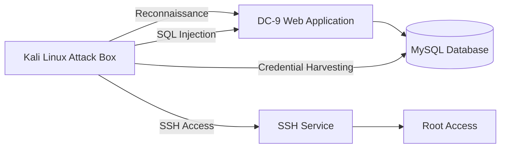

# Adversary Emulation & MITRE ATT&CK Operations

## Overview

This lab focused on conducting a structured adversary emulation exercise against the VulnHub DC-9 environment. The objective was to simulate a realistic cyber attack campaign using tactics, techniques, and procedures (TTPs) aligned with the MITRE ATT&CK framework while maintaining strict operational security controls and safety boundaries.

Unlike traditional penetration testing, adversary emulation focuses on replicating how real-world threat actors progress through an attack lifecycle. The exercise included reconnaissance, web application exploitation, credential harvesting, lateral movement, and privilege escalation activities, all documented and mapped directly to ATT&CK techniques.

The engagement was performed in a fully isolated environment to ensure safe and controlled execution.

---

# Objectives

The primary objectives of this exercise were:

- Simulate a realistic adversary attack chain.
    
- Map offensive activities to MITRE ATT&CK techniques.
    
- Identify detection opportunities throughout the kill chain.
    
- Document attack artifacts and forensic evidence.
    
- Evaluate defensive visibility and monitoring requirements.
    
- Demonstrate red team operational planning and execution.
    
- Maintain strict operational security (OPSEC) controls.
    

---

# Environment Overview

## Infrastructure

|Component|Details|
|---|---|
|Target VM|VulnHub DC-9|
|Target IP|10.0.2.3|
|Attacker VM|Kali Linux 2024|
|Attacker IP|10.0.2.15|
|Network Type|Host-Only|
|Internet Access|Disabled|
|Framework|MITRE ATT&CK|

---

## Lab Architecture



---

# Adversary Emulation Methodology

The engagement followed a realistic attack lifecycle:

```text
Reconnaissance
        ↓
Enumeration
        ↓
Initial Access
        ↓
Credential Access
        ↓
Lateral Movement
        ↓
Privilege Escalation
        ↓
Objective Completion
```

---

# MITRE ATT&CK Coverage

|Tactic|Technique ID|Technique|
|---|---|---|
|Reconnaissance|T1595.001|Active Scanning|
|Initial Access|T1190|Exploit Public-Facing Application|
|Credential Access|T1552.001|Unsecured Credentials|
|Discovery|T1083|File and Directory Discovery|
|Discovery|T1046|Network Service Discovery|
|Lateral Movement|T1021.002|Remote Services: SSH|
|Privilege Escalation|T1068|Exploitation for Privilege Escalation|
|Collection|T1005|Data from Local System|

---

# Operational Security Controls

To maintain a realistic yet safe emulation environment, multiple OPSEC controls were implemented.

## Network Isolation

The exercise was conducted entirely within a host-only VirtualBox network.

### Controls

- No NAT networking
    
- No bridged networking
    
- No internet connectivity
    
- Traffic restricted to lab environment
    

### Validation

```bash
ping 8.8.8.8
curl google.com
```

External communication was blocked throughout the exercise.

---

## Safety Boundaries

The following activities were authorized:

- Host discovery
    
- Port scanning
    
- Service enumeration
    
- SQL Injection validation
    
- Credential harvesting
    
- SSH access
    
- Privilege escalation
    
- Local file analysis
    

The following activities were explicitly prohibited:

- Internet-facing targets
    
- External IP addresses
    
- Production systems
    
- Third-party infrastructure
    

---

# Phase 1 – Reconnaissance

## Objective

Identify exposed services, technologies, and potential attack vectors.

---

## Active Scanning

### MITRE ATT&CK

```text
T1595.001
Active Scanning
```

### Activities

- Host discovery
    
- Port enumeration
    
- Service fingerprinting
    
- Web application identification
    

---

## Key Findings

### Open Services

|Port|Service|
|---|---|
|80|Apache Web Server|
|22|SSH (Initially Restricted)|

### Technologies Identified

- Apache 2.4.38
    
- PHP
    
- MySQL
    
- Debian Linux
    

---

## Security Observations

- Public-facing web application
    
- Dynamic PHP functionality
    
- Multiple exposed application endpoints
    
- Potential database-backed search functionality
    

---

# Phase 2 – Web Application Enumeration

## Objective

Map application functionality and identify attack surface.

---

## Directory Enumeration

Multiple application endpoints were identified:

```text
/search.php
/display.php
/manage.php
/db/
```

---

## Security Findings

### Missing Security Headers

Observed deficiencies included:

- Missing X-Frame-Options
    
- Missing X-Content-Type-Options
    
- Weak application hardening
    

---

## Additional Exposure

### Directory Listing Enabled

The application exposed internal resources through misconfigured directory permissions.

### Local File Inclusion Indicators

Input parameters suggested possible file inclusion opportunities.

---

# Phase 3 – Initial Access

## Objective

Obtain initial foothold through exploitation of a public-facing application.

---

## MITRE ATT&CK

```text
T1190
Exploit Public-Facing Application
```

---

## SQL Injection Discovery

The application's search functionality exhibited behavior consistent with SQL injection vulnerabilities.

### Vulnerability Types Identified

- Boolean-Based Blind SQL Injection
    
- Time-Based Blind SQL Injection
    
- UNION-Based SQL Injection
    

---

## Impact

Successful exploitation enabled:

- Database enumeration
    
- User enumeration
    
- Credential discovery
    
- Application compromise
    

---

# Phase 4 – Credential Access

## Objective

Acquire credentials through post-exploitation activities.

---

## MITRE ATT&CK

```text
T1552.001
Credentials in Files
```

---

## Credential Harvesting

Multiple credential repositories were identified during enumeration.

### Sources

- Database records
    
- Local configuration files
    
- User notes
    
- Application artifacts
    

---

## Outcome

The exercise successfully demonstrated how improperly stored credentials can enable progression through later attack phases.

---

# Phase 5 – Discovery

## Objective

Understand the internal environment and identify pathways to higher privileges.

---

## Activities

### File System Enumeration

```text
T1083
File and Directory Discovery
```

### Service Discovery

```text
T1046
Network Service Discovery
```

---

## Key Findings

- User account information
    
- Service configurations
    
- Administrative scripts
    
- Internal operational data
    

---

# Phase 6 – Lateral Movement

## Objective

Leverage harvested credentials to access additional services.

---

## MITRE ATT&CK

```text
T1021.002
Remote Services: SSH
```

---

## SSH Access

Validated credentials enabled remote access to the target environment.

### Security Implications

- Credential reuse
    
- Weak credential management
    
- Lack of privilege separation
    

---

## Outcome

Successful authenticated access expanded visibility into the host and enabled privilege escalation activities.

---

# Phase 7 – Privilege Escalation

## Objective

Obtain elevated privileges through system misconfigurations.

---

## MITRE ATT&CK

```text
T1068
Exploitation for Privilege Escalation
```

---

## Findings

The environment contained privilege escalation opportunities arising from insecure configurations.

### Examples

- Excessive sudo permissions
    
- Misconfigured binaries
    
- Insecure execution paths
    

---

## Impact

Successful exploitation resulted in elevated access to critical system resources.

---

# Attack Chain Visualization

```text
External Attacker
        ↓
Reconnaissance
        ↓
Application Enumeration
        ↓
SQL Injection
        ↓
Database Access
        ↓
Credential Harvesting
        ↓
SSH Authentication
        ↓
Privilege Escalation
        ↓
Objective Completion
```

---

# Detection Opportunities

Each ATT&CK technique provides opportunities for defensive monitoring.

|Technique|Detection Source|
|---|---|
|Active Scanning|Firewall Logs|
|SQL Injection|WAF Logs|
|Credential Harvesting|Audit Logs|
|SSH Authentication|Authentication Logs|
|Privilege Escalation|Syslog / EDR|

---

# Defensive Recommendations

## Web Application Security

- Parameterized SQL queries
    
- Input validation
    
- Secure coding standards
    
- WAF deployment
    

---

## Authentication Security

- Strong password policies
    
- Credential rotation
    
- MFA implementation
    
- Account monitoring
    

---

## Infrastructure Security

- Least privilege access
    
- Sudo hardening
    
- Service segmentation
    
- Configuration management
    

---

## Monitoring & Detection

- Centralized logging
    
- ATT&CK-based detections
    
- Anomaly detection
    
- Security event correlation
    

---

# Lessons Learned

This exercise demonstrated how seemingly isolated weaknesses can be chained together to achieve significant impact. SQL Injection, credential exposure, weak privilege management, and insufficient segmentation collectively enabled a complete attack path from unauthenticated access to elevated privileges.

The lab reinforced the value of MITRE ATT&CK for documenting offensive operations, identifying defensive gaps, and creating repeatable adversary emulation scenarios.

---

# Skills Demonstrated

- Adversary Emulation
    
- MITRE ATT&CK Mapping
    
- Red Team Methodology
    
- Attack Path Analysis
    
- Web Application Security Testing
    
- Credential Access Techniques
    
- SSH Security Assessment
    
- Privilege Escalation Analysis
    
- Detection Opportunity Mapping
    
- Operational Security (OPSEC)
    
- Security Reporting
    
- Threat-Informed Defense
    

---

# Disclaimer

This project was conducted within an isolated and authorized academic laboratory environment. All testing was performed against intentionally vulnerable systems for educational and defensive security purposes only.