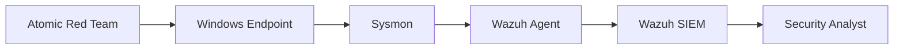
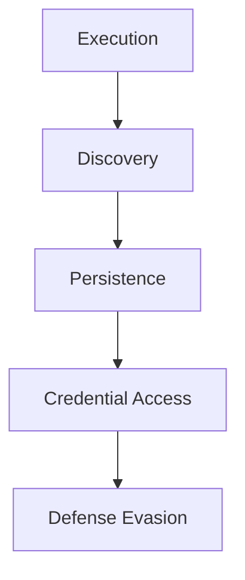

# Detection Engineering & ATT&CK-Based Threat Detection

## Overview

This project focused on designing, implementing, and validating a detection engineering program using Wazuh SIEM, Sysmon, and Atomic Red Team. The objective was to develop ATT&CK-aligned detection logic capable of identifying adversary behaviors across multiple stages of the cyber attack lifecycle.

Rather than relying solely on default SIEM signatures, custom detection rules were engineered to identify high-value attacker techniques including credential access, persistence, discovery, and defense evasion. Each detection was validated through controlled adversary simulations using Atomic Red Team and mapped directly to the MITRE ATT&CK framework.

The exercise demonstrates how modern Security Operations Centers (SOCs) build detection coverage, reduce false positives, and continuously improve visibility into attacker behavior.

---

# Objectives

The primary objectives of this lab were:

- Deploy a centralized detection and monitoring environment.
    
- Collect endpoint telemetry using Sysmon.
    
- Develop ATT&CK-aligned custom detection rules.
    
- Validate detections using Atomic Red Team simulations.
    
- Measure detection effectiveness and alert quality.
    
- Identify detection gaps and improvement opportunities.
    
- Demonstrate practical detection engineering workflows.
    

---

# Detection Engineering Methodology

The project followed a threat-informed detection engineering lifecycle.

```text
Threat Research
        ↓
ATT&CK Mapping
        ↓
Telemetry Collection
        ↓
Detection Development
        ↓
Adversary Simulation
        ↓
Validation
        ↓
Gap Analysis
        ↓
Rule Tuning
```

---

# Lab Architecture

## Environment Components

|Component|Purpose|
|---|---|
|Wazuh Manager|SIEM & Alerting Platform|
|Wazuh Agent|Endpoint Monitoring|
|Sysmon|Advanced Windows Telemetry|
|Atomic Red Team|Adversary Simulation|
|Windows Endpoint|Detection Target|
|VirtualBox|Lab Infrastructure|

---

## Detection Pipeline



---

# Detection Strategy

The detection program was built using a threat-informed approach focused on high-risk ATT&CK techniques frequently observed in real-world intrusions.

### Prioritized ATT&CK Tactics

- Credential Access
    
- Persistence
    
- Discovery
    
- Defense Evasion
    
- Execution
    

---

# Telemetry Sources

## Sysmon

Sysmon was configured to provide enhanced endpoint visibility.

### Key Events Collected

|Event Type|Purpose|
|---|---|
|Process Creation|Execution Monitoring|
|Registry Modification|Persistence Detection|
|Network Connections|C2 Visibility|
|Image Loading|Malware Analysis|
|Command Line Logging|Behavioral Detection|

---

## Wazuh

Wazuh served as the centralized collection, correlation, and alerting platform.

### Capabilities

- Event Correlation
    
- Custom Rule Development
    
- ATT&CK Mapping
    
- Alert Prioritization
    
- Dashboard Visualization
    

---

# Detection Use Case 1 – Credential Access

## MITRE ATT&CK

```text
T1003.001
OS Credential Dumping: LSASS Memory
```

---

## Threat Description

Credential dumping remains one of the most common post-exploitation activities used by attackers to harvest credentials from memory.

Attackers frequently target the LSASS process because it stores authentication material that may be leveraged for privilege escalation or lateral movement.

---

## Detection Logic

The custom detection rule was designed to identify suspicious access patterns targeting LSASS memory.

### Telemetry Utilized

- Process Creation Events
    
- Command Line Arguments
    
- Process Access Monitoring
    

### Alert Characteristics

|Severity|Level|
|---|---|
|High|10|

---

## Validation

### Atomic Red Team Simulation

```powershell
Invoke-AtomicTest T1003 -TestNumbers 6
```

### Expected Behavior

- Suspicious process creation
    
- LSASS access attempt
    
- Memory dumping indicators
    

### Result

✅ Detection Successfully Triggered

---

# Detection Use Case 2 – Persistence

## MITRE ATT&CK

```text
T1547.001
Registry Run Keys / Startup Folder
```

---

## Threat Description

Registry Run Keys are commonly abused to establish persistence and automatically execute malicious payloads during system startup or user logon.

---

## Detection Logic

The rule monitors modifications to registry locations frequently used for persistence.

### Monitored Locations

```text
HKCU\Software\Microsoft\Windows\CurrentVersion\Run

HKLM\Software\Microsoft\Windows\CurrentVersion\Run
```

---

## Telemetry Utilized

- Registry Modification Events
    
- Process Creation Logs
    
- Parent/Child Process Relationships
    

---

## Validation

### Atomic Red Team Simulation

```powershell
Invoke-AtomicTest T1547.001 -TestNumbers 1
```

### Result

✅ Detection Successfully Triggered

---

# Detection Use Case 3 – System Discovery

## MITRE ATT&CK

```text
T1082
System Information Discovery
```

---

## Threat Description

Attackers frequently gather system information to understand the environment before progressing to later attack stages.

Common discovery commands include:

```text
systeminfo
hostname
whoami
ipconfig
```

---

## Detection Logic

The rule identifies suspicious execution of system discovery commands originating from scripting environments or suspicious parent processes.

---

## Validation

### Atomic Red Team Simulation

```powershell
Invoke-AtomicTest T1082 -TestNumbers 1
```

### Result

✅ Detection Successfully Triggered

---

# Detection Use Case 4 – Obfuscated PowerShell

## MITRE ATT&CK

```text
T1027
Obfuscated Files or Information
```

---

## Threat Description

PowerShell obfuscation is commonly used to evade detection and conceal malicious intent.

---

## Detection Logic

The rule identifies:

- Base64 encoded payloads
    
- Suspicious PowerShell parameters
    
- Encoded command execution
    
- Obfuscation indicators
    

---

## Detection Sources

- PowerShell Logs
    
- Command Line Telemetry
    
- Sysmon Event Data
    

---

## Security Impact

Early detection of obfuscated PowerShell significantly improves the ability to identify malware execution and post-exploitation activity.

---

# ATT&CK Coverage Matrix

|ATT&CK Technique|Description|Detection Status|
|---|---|---|
|T1003.001|LSASS Memory Dumping|Detected|
|T1547.001|Registry Run Keys|Detected|
|T1082|System Information Discovery|Detected|
|T1027|Obfuscated PowerShell|Detected|

---

# Detection Validation Matrix

|Technique|Simulation|Expected Alert|Result|
|---|---|---|---|
|T1003.001|Atomic Test #6|Credential Access Alert|Success|
|T1547.001|Atomic Test #1|Persistence Alert|Success|
|T1082|Atomic Test #1|Discovery Alert|Success|
|T1027|PowerShell Execution|Obfuscation Alert|Success|

---

# Detection Coverage Visualization



---

# Gap Analysis

Although all targeted ATT&CK techniques were successfully detected, several opportunities for improvement were identified.

## Coverage Gaps

### Limited Lateral Movement Visibility

Additional detections could be developed for:

- Remote Services
    
- SMB Activity
    
- Pass-the-Hash
    
- Remote PowerShell
    

---

### Command and Control Monitoring

Future detection development should include:

- Beacon Detection
    
- Suspicious DNS Activity
    
- Unusual Network Connections
    
- C2 Framework Indicators
    

---

### Privilege Escalation

Additional rules should be developed for:

- Token Manipulation
    
- UAC Bypass
    
- Service Abuse
    
- Scheduled Task Abuse
    

---

# Detection Engineering Best Practices

The following principles guided detection development:

### High Fidelity

Focus on behavior rather than signatures.

### ATT&CK Alignment

Map every detection to ATT&CK techniques.

### Validation Driven

Continuously validate detections through simulation.

### False Positive Reduction

Tune rules to maximize signal-to-noise ratio.

### Threat-Informed Defense

Prioritize detections based on real-world adversary behaviors.

---

# Security Outcomes

The project successfully demonstrated:

- ATT&CK-based detection development.
    
- Telemetry engineering using Sysmon.
    
- SIEM rule creation using Wazuh.
    
- Adversary simulation using Atomic Red Team.
    
- Detection validation and tuning.
    
- Security monitoring workflow development.
    

---

# Skills Demonstrated

- Detection Engineering
    
- SIEM Engineering
    
- Wazuh Administration
    
- Sysmon Configuration
    
- ATT&CK Mapping
    
- Threat Detection
    
- Atomic Red Team
    
- Security Monitoring
    
- Rule Development
    
- Detection Validation
    
- Gap Analysis
    
- Blue Team Operations
    

---

# Lessons Learned

Modern security operations depend on visibility, telemetry quality, and threat-informed detection strategies rather than signature-based detection alone. This exercise demonstrated how ATT&CK-aligned detections can be developed, tested, and validated through adversary emulation to improve an organization's ability to detect and respond to real-world attacks.

By combining Sysmon, Wazuh, and Atomic Red Team, the lab established a repeatable detection engineering workflow capable of continuously improving defensive security posture.

---

# Disclaimer

This project was conducted within an isolated and authorized academic laboratory environment. All simulations, detections, and ATT&CK mappings were performed for educational and defensive security purposes only.