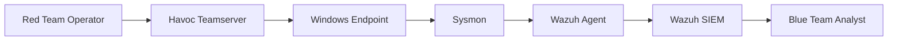
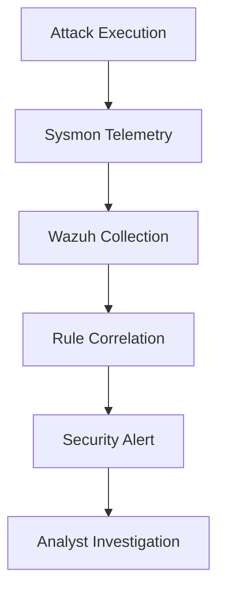

# Purple Team Operations & Adversary Simulation

## Overview

This project focused on conducting a Purple Team exercise designed to validate the effectiveness of existing detection capabilities against realistic adversary behaviors. The exercise combined offensive operations using a Command and Control (C2) framework with defensive monitoring through Wazuh SIEM and Sysmon telemetry.

The primary objective was not simply to compromise a target system, but to measure how effectively defensive controls could identify, alert on, and respond to attacker activity throughout the attack lifecycle.

The exercise simulated a real-world intrusion beginning with Command & Control establishment, followed by post-exploitation activities including credential access and persistence-related behaviors. Detection coverage was evaluated through ATT&CK-aligned telemetry collection, alert validation, and detection latency analysis.

---

# Objectives

The primary objectives of the exercise were:

- Simulate realistic attacker behavior using a modern C2 framework.
    
- Establish command and control communications.
    
- Generate ATT&CK-aligned attacker telemetry.
    
- Validate existing Wazuh detection rules.
    
- Measure detection latency and alert quality.
    
- Identify visibility gaps across the attack chain.
    
- Improve collaboration between offensive and defensive security operations.
    

---

# Purple Team Methodology

The exercise followed a collaborative security validation workflow.

```text
Threat Emulation
        ↓
Attack Execution
        ↓
Telemetry Generation
        ↓
Detection Validation
        ↓
Alert Analysis
        ↓
Gap Identification
        ↓
Rule Improvement
```

Unlike traditional Red Team engagements, Purple Teaming emphasizes continuous feedback between attackers and defenders to improve organizational detection capabilities.

---

# Lab Environment

## Infrastructure Overview

|Component|Purpose|
|---|---|
|Havoc C2|Adversary Emulation Platform|
|Windows 10 Endpoint|Target System|
|Sysmon|Endpoint Telemetry|
|Wazuh Agent|Event Collection|
|Wazuh SIEM|Detection & Alerting|
|Atomic Red Team|ATT&CK Simulation|

---

## Purple Team Architecture



---

# Threat Model

The exercise simulated an attacker attempting to:

1. Establish command and control.
    
2. Maintain access.
    
3. Gather credentials.
    
4. Generate ATT&CK telemetry.
    
5. Evade basic detection controls.
    

---

# ATT&CK Coverage

|Tactic|Technique|
|---|---|
|Command and Control|Application Layer Protocol|
|Execution|Command and Scripting Interpreter|
|Credential Access|LSASS Memory Dumping|
|Discovery|System Information Discovery|
|Persistence|Registry Run Keys|
|Defense Evasion|Obfuscated PowerShell|

---

# Phase 1 – Command & Control Establishment

## Objective

Simulate the establishment of a command-and-control channel between an attacker-controlled infrastructure and a compromised endpoint.

---

## C2 Infrastructure

### Platform

```text
Havoc C2
```

Havoc was selected to emulate modern adversary post-exploitation behavior and provide realistic attacker telemetry.

---

## Teamserver Configuration

The teamserver was configured with:

- TLS-encrypted communications
    
- Custom listener profiles
    
- Operator authentication
    
- Secure callback channels
    

---

## Detection Considerations

Blue Team objectives included identifying:

- Unusual outbound communications
    
- Suspicious process execution
    
- Beaconing activity
    
- Anomalous network behavior
    

---

# Phase 2 – Payload Generation & Delivery

## Objective

Simulate the delivery and execution of a malicious payload.

---

## Payload Characteristics

The payload was configured to:

- Establish a callback channel
    
- Execute within user context
    
- Maintain communication with the teamserver
    
- Generate realistic post-exploitation telemetry
    

---

## ATT&CK Mapping

|Technique|Description|
|---|---|
|T1105|Ingress Tool Transfer|
|T1059|Command Execution|
|T1071|Application Layer Protocol|

---

## Security Implications

Successful payload execution demonstrates how an attacker can transition from initial access into active command-and-control operations.

---

# Phase 3 – Successful Callback Validation

## Objective

Verify successful establishment of a persistent communication channel.

---

## Observed Behavior

Following payload execution:

- Beacon communications were established.
    
- Teamserver communications became active.
    
- Endpoint telemetry recorded process creation events.
    
- Network artifacts became visible to monitoring tools.
    

---

## Detection Opportunities

Potential detection sources included:

- Network telemetry
    
- Sysmon Event IDs
    
- Process creation logs
    
- Parent-child process analysis
    

---

# Phase 4 – Post-Exploitation Activities

After establishing command and control, attacker activity shifted toward credential access and reconnaissance.

---

# Credential Access Simulation

## MITRE ATT&CK

```text
T1003.001
OS Credential Dumping: LSASS Memory
```

---

## Objective

Evaluate the organization's ability to detect credential theft attempts.

---

## Adversary Activity

The simulation generated behavior consistent with:

- Memory dumping
    
- Credential harvesting
    
- Sensitive process access
    

---

## Security Impact

Successful credential theft can enable:

- Privilege escalation
    
- Lateral movement
    
- Domain compromise
    
- Long-term persistence
    

---

# Blue Team Detection Validation

## Existing Detection Coverage

The following detections were evaluated during the exercise:

|Detection|Status|
|---|---|
|LSASS Memory Dumping|Validated|
|Registry Persistence|Validated|
|Discovery Commands|Validated|
|PowerShell Obfuscation|Validated|

---

## Detection Workflow



---

# Detection Latency Analysis

## Objective

Measure the time required for defensive controls to identify attacker activity.

---

## Metrics Evaluated

### Mean Detection Time (MDT)

Time between attack execution and alert generation.

### Alert Fidelity

Accuracy and usefulness of generated alerts.

### ATT&CK Coverage

Percentage of simulated techniques successfully detected.

---

## Findings

The exercise demonstrated:

- Successful ATT&CK-based detections.
    
- Effective telemetry collection.
    
- Strong visibility into post-exploitation activity.
    
- Opportunities for further rule tuning.
    

---

# Purple Team Findings

## Strengths

### Credential Access Detection

The environment successfully detected LSASS memory dumping behavior.

### Persistence Monitoring

Registry-based persistence activities generated reliable alerts.

### Discovery Detection

System information gathering was successfully identified.

---

## Areas for Improvement

### Network-Based Detections

Additional visibility into beaconing traffic would improve early detection.

### Command and Control Analytics

Behavioral detections for C2 frameworks should be expanded.

### Lateral Movement Monitoring

Additional detections should be developed for:

- SMB activity
    
- Remote PowerShell
    
- Pass-the-Hash
    
- Remote Services
    

---

# ATT&CK Validation Matrix

|Technique|ATT&CK ID|Detection Status|
|---|---|---|
|Command & Control|T1071|Partial|
|Credential Dumping|T1003.001|Detected|
|Registry Persistence|T1547.001|Detected|
|System Discovery|T1082|Detected|
|Obfuscated PowerShell|T1027|Detected|

---

# Security Recommendations

## Detection Engineering

- Expand ATT&CK coverage.
    
- Develop beacon detection analytics.
    
- Improve command-line visibility.
    
- Implement Sigma-based detections.
    

---

## Monitoring

- Enhance network telemetry collection.
    
- Deploy behavioral analytics.
    
- Improve process ancestry monitoring.
    
- Enable advanced PowerShell logging.
    

---

## Purple Team Operations

- Conduct recurring ATT&CK validation exercises.
    
- Build adversary emulation playbooks.
    
- Track ATT&CK coverage metrics.
    
- Measure detection improvements over time.
    

---

# Security Outcomes

The exercise successfully demonstrated:

- Realistic adversary simulation.
    
- Command and control emulation.
    
- Detection validation through ATT&CK techniques.
    
- Blue Team visibility assessment.
    
- Detection latency measurement.
    
- Threat-informed defensive improvements.
    

---

# Skills Demonstrated

- Purple Team Operations
    
- ATT&CK-Based Adversary Emulation
    
- Havoc C2
    
- Threat Detection Engineering
    
- Wazuh SIEM
    
- Sysmon Analysis
    
- Detection Validation
    
- Security Monitoring
    
- Attack Simulation
    
- Detection Latency Analysis
    
- Threat-Informed Defense
    
- Security Operations
    

---

# Lessons Learned

Modern security programs require continuous validation of defensive controls against realistic adversary behavior. Purple Team exercises provide a structured mechanism for measuring detection effectiveness, improving ATT&CK coverage, and strengthening collaboration between offensive and defensive security teams.

This exercise demonstrated how adversary emulation, telemetry engineering, and detection validation can be combined to improve an organization's overall security maturity.

---

# Disclaimer

This project was conducted within an isolated and authorized academic laboratory environment. All attack simulations, command-and-control activities, and ATT&CK mappings were performed for educational and defensive security purposes only.