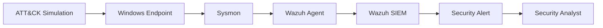

# Security Control Validation & Detection Effectiveness Assessment

## Overview

This project focused on evaluating the effectiveness of deployed security controls through ATT&CK-aligned adversary simulations and detection validation exercises. Following the Purple Team operation conducted in Lab 05, this phase measured how well defensive technologies detected, correlated, and responded to attacker activity across multiple stages of the attack lifecycle.

The objective was to assess detection coverage, alert quality, detection latency, and compliance alignment while identifying opportunities to strengthen monitoring capabilities and improve overall defensive maturity.

Rather than introducing new attacks, this phase focused on validating whether existing security controls provided adequate visibility into simulated adversary behavior.

---

# Objectives

The primary objectives of this assessment were:

- Validate existing detection capabilities.
    
- Measure security control effectiveness.
    
- Evaluate ATT&CK technique coverage.
    
- Assess detection latency.
    
- Analyze alert fidelity.
    
- Identify visibility gaps.
    
- Map controls to compliance frameworks.
    
- Develop recommendations for improving detection maturity.
    

---

# Validation Methodology

The assessment followed a structured validation workflow.

```text
Security Controls
        ↓
Adversary Simulation
        ↓
Telemetry Collection
        ↓
Detection Validation
        ↓
Alert Analysis
        ↓
Gap Assessment
        ↓
Control Improvement
```

The methodology was designed to ensure that defensive controls were evaluated against realistic attacker behaviors rather than theoretical scenarios.

---

# Security Architecture

## Components Evaluated

|Component|Function|
|---|---|
|Wazuh SIEM|Event Correlation & Alerting|
|Sysmon|Endpoint Telemetry|
|Wazuh Agent|Log Collection|
|Atomic Red Team|Adversary Simulation|
|Windows Endpoint|Detection Target|
|Custom Detection Rules|ATT&CK-Based Analytics|

---

## Validation Pipeline



---

# Security Controls Under Evaluation

The assessment focused on evaluating controls responsible for detecting adversary behavior across multiple ATT&CK tactics.

### Credential Access Controls

Objective:

Detect attempts to access or dump credential material from memory.

---

### Persistence Controls

Objective:

Identify modifications designed to survive system reboot or user logon.

---

### Discovery Controls

Objective:

Detect attacker reconnaissance activities conducted after initial compromise.

---

### Defense Evasion Controls

Objective:

Identify attempts to conceal malicious activity from security monitoring systems.

---

# ATT&CK Coverage Assessment

The validation exercise focused on techniques frequently observed during real-world intrusions.

|ATT&CK ID|Technique|
|---|---|
|T1003.001|LSASS Memory Dumping|
|T1547.001|Registry Run Key Persistence|
|T1082|System Information Discovery|
|T1027|Obfuscated Files or Information|

---

# Validation Scenario 1 – Credential Access Detection

## ATT&CK Technique

```text
T1003.001
OS Credential Dumping: LSASS Memory
```

---

## Threat Description

Attackers frequently target the Local Security Authority Subsystem Service (LSASS) process to extract credentials stored in memory.

Successful credential dumping may enable:

- Privilege escalation
    
- Lateral movement
    
- Domain compromise
    
- Persistent access
    

---

## Security Control Evaluated

### Custom Wazuh Detection Rule

Detection Logic:

- Suspicious process creation
    
- Access to LSASS memory
    
- Known credential dumping indicators
    

---

## Validation Result

|Metric|Result|
|---|---|
|Alert Generated|Yes|
|ATT&CK Mapping|Correct|
|Severity|High|
|False Positives|None Observed|

### Assessment

The security control successfully detected credential access behavior and generated actionable alerts.

---

# Validation Scenario 2 – Persistence Detection

## ATT&CK Technique

```text
T1547.001
Registry Run Keys
```

---

## Threat Description

Registry Run Keys are frequently abused to establish persistence and automatically execute malicious payloads during user logon.

---

## Security Control Evaluated

### Registry Monitoring Rules

Detection Logic:

- Monitoring Run Key modifications
    
- Tracking registry changes
    
- Identifying suspicious persistence mechanisms
    

---

## Validation Result

|Metric|Result|
|---|---|
|Alert Generated|Yes|
|ATT&CK Mapping|Correct|
|Severity|High|
|False Positives|Low|

### Assessment

The detection rule successfully identified persistence-related modifications.

---

# Validation Scenario 3 – Discovery Detection

## ATT&CK Technique

```text
T1082
System Information Discovery
```

---

## Threat Description

Following compromise, attackers often gather information regarding:

- Operating systems
    
- Installed software
    
- Hostnames
    
- Domain membership
    
- Hardware configuration
    

---

## Security Control Evaluated

### Discovery Monitoring Rules

Detection Logic:

- Monitoring system discovery commands
    
- Parent-child process correlation
    
- Script-based reconnaissance activity
    

---

## Validation Result

|Metric|Result|
|---|---|
|Alert Generated|Yes|
|ATT&CK Mapping|Correct|
|Severity|Medium|
|False Positives|Low|

### Assessment

The control provided strong visibility into post-compromise reconnaissance activity.

---

# Validation Scenario 4 – Defense Evasion Detection

## ATT&CK Technique

```text
T1027
Obfuscated Files or Information
```

---

## Threat Description

Adversaries frequently obfuscate commands and payloads to bypass security monitoring.

Common examples include:

- Base64 encoding
    
- Encoded PowerShell
    
- Obfuscated scripts
    
- Hidden execution parameters
    

---

## Security Control Evaluated

### Obfuscated Command Detection Rules

Detection Logic:

- Encoded command detection
    
- Suspicious PowerShell arguments
    
- Command-line analysis
    

---

## Validation Result

|Metric|Result|
|---|---|
|Alert Generated|Yes|
|ATT&CK Mapping|Correct|
|Severity|Medium-High|
|False Positives|Low|

### Assessment

The detection logic successfully identified defense evasion behavior.

---

# Detection Validation Matrix

|ATT&CK Technique|Detection Status|Severity|
|---|---|---|
|T1003.001|Detected|High|
|T1547.001|Detected|High|
|T1082|Detected|Medium|
|T1027|Detected|Medium-High|

---

# Detection Effectiveness Assessment

## Coverage Evaluation

### Credential Access

Coverage Status:

```text
Strong
```

Visibility into credential theft techniques was successfully demonstrated.

---

### Persistence

Coverage Status:

```text
Strong
```

Persistence-related registry modifications were reliably detected.

---

### Discovery

Coverage Status:

```text
Strong
```

Reconnaissance activity generated actionable telemetry.

---

### Defense Evasion

Coverage Status:

```text
Moderate
```

Basic obfuscation techniques were detected; additional behavioral analytics would improve coverage.

---

# Detection Latency Analysis

## Objective

Measure the time required for security controls to identify attacker activity and generate alerts.

---

## Evaluation Metrics

### Mean Detection Time (MDT)

Time elapsed between attack execution and alert generation.

---

### Alert Fidelity

Ability of alerts to accurately describe attacker behavior.

---

### ATT&CK Accuracy

Correct mapping of alerts to ATT&CK techniques.

---

### Investigation Readiness

Ability of analysts to immediately triage and investigate alerts.

---

## Findings

The environment demonstrated:

- Near-real-time alert generation.
    
- Accurate ATT&CK mappings.
    
- Actionable investigation context.
    
- High-quality telemetry collection.
    

---

# Gap Assessment

Although all targeted techniques were successfully detected, several improvement opportunities were identified.

---

## Command & Control Visibility

Current visibility into beaconing activity remains limited.

### Recommended Enhancements

- Network telemetry collection
    
- Beacon analytics
    
- DNS anomaly detection
    
- C2 hunting dashboards
    

---

## Lateral Movement Coverage

Additional detections should be developed for:

- SMB abuse
    
- Pass-the-Hash
    
- WinRM activity
    
- Remote PowerShell
    

---

## Privilege Escalation Coverage

Future detections should focus on:

- UAC bypass
    
- Token manipulation
    
- Service abuse
    
- Scheduled task persistence
    

---

# Compliance Mapping

The assessment mapped validated controls against major cybersecurity frameworks.

---

## NIST Cybersecurity Framework

### Detect Function

Validated:

- Continuous monitoring
    
- Event analysis
    
- Threat detection
    

### Respond Function

Validated:

- Alert generation
    
- Incident visibility
    
- Investigative context
    

---

## NIST SP 800-53

|Control|Purpose|
|---|---|
|AU-6|Audit Review|
|SI-4|System Monitoring|
|IR-5|Incident Monitoring|
|SI-10|Input Validation|
|AC-6|Least Privilege|

---

## MITRE ATT&CK

The exercise validated ATT&CK coverage across:

- Credential Access
    
- Persistence
    
- Discovery
    
- Defense Evasion
    

---

# Security Maturity Assessment

|Domain|Assessment|
|---|---|
|Telemetry Collection|Mature|
|Alert Generation|Mature|
|ATT&CK Mapping|Mature|
|Detection Engineering|Mature|
|Threat Hunting Readiness|Developing|
|Network Detection|Developing|

---

# Security Outcomes

The assessment successfully demonstrated:

- Effective ATT&CK-based detection coverage.
    
- Reliable telemetry collection.
    
- Accurate security alert generation.
    
- Strong analyst visibility.
    
- Actionable security monitoring.
    
- Measurable defensive capabilities.
    

---

# Recommendations

## Short-Term

- Expand ATT&CK coverage.
    
- Improve network telemetry.
    
- Enhance PowerShell monitoring.
    
- Develop lateral movement detections.
    

---

## Medium-Term

- Deploy Sigma-based analytics.
    
- Implement threat hunting workflows.
    
- Build ATT&CK coverage dashboards.
    
- Improve alert enrichment.
    

---

## Long-Term

- Adopt continuous validation programs.
    
- Integrate adversary emulation into operations.
    
- Develop purple team metrics.
    
- Establish security control performance baselines.
    

---

# Skills Demonstrated

- Detection Engineering
    
- Security Validation
    
- ATT&CK Mapping
    
- Security Metrics Development
    
- Detection Effectiveness Assessment
    
- Security Control Evaluation
    
- Wazuh SIEM
    
- Sysmon Analysis
    
- Atomic Red Team
    
- Compliance Mapping
    
- Security Operations
    
- Blue Team Methodology
    

---

# Lessons Learned

Security controls should not be assumed effective simply because they are deployed. Continuous validation through ATT&CK-based simulations provides measurable evidence of defensive effectiveness and enables organizations to continuously improve detection coverage, reduce risk, and strengthen overall security posture.

This project demonstrated how threat-informed defense can be used to validate security investments, identify visibility gaps, and improve operational readiness.

---

# Disclaimer

This project was conducted within an isolated and authorized academic laboratory environment. All simulations, detections, and ATT&CK mappings were performed for educational and defensive security purposes only.