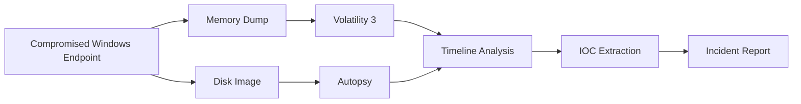

# Digital Forensics & Incident Response (DFIR): Enterprise Compromise Investigation

## Overview

This project focused on conducting a full-scale Digital Forensics and Incident Response (DFIR) investigation following the simulated compromise of a Windows endpoint. The objective was to reconstruct the attack lifecycle, identify Indicators of Compromise (IOCs), determine attacker actions, and assess the overall impact of the intrusion.

The investigation centered around a Command and Control (C2) intrusion involving a Sliver-based implant and subsequent credential theft activities. Using memory forensics, disk analysis, timeline reconstruction, and artifact correlation, the complete attack chain was reconstructed from initial compromise through credential access and command-and-control communications.

The investigation followed industry-standard forensic methodologies to ensure evidence integrity, repeatability, and forensic soundness.

---

# Objectives

The primary objectives of the investigation were:

- Acquire and preserve forensic evidence.
    
- Conduct memory forensic analysis.
    
- Perform disk forensic examination.
    
- Identify attacker artifacts and persistence mechanisms.
    
- Reconstruct the attack timeline.
    
- Extract Indicators of Compromise (IOCs).
    
- Map attacker activity to MITRE ATT&CK.
    
- Develop incident response recommendations.
    
- Demonstrate DFIR methodologies used in enterprise investigations.
    

---

# Investigation Methodology

The investigation followed a structured incident response workflow.

```text
Incident Identification
          ↓
Evidence Acquisition
          ↓
Evidence Preservation
          ↓
Memory Analysis
          ↓
Disk Analysis
          ↓
Timeline Reconstruction
          ↓
IOC Extraction
          ↓
Impact Assessment
          ↓
Containment & Recommendations
```

---

# Incident Scenario

The investigation simulated a post-compromise environment where an attacker successfully deployed a Command & Control implant and conducted credential theft activities.

### Primary Investigation Questions

- How did the attacker gain access?
    
- What payloads were executed?
    
- What systems were affected?
    
- Was command and control established?
    
- Were credentials stolen?
    
- What indicators remain on disk and memory?
    
- What ATT&CK techniques were utilized?
    

---

# Forensic Environment

## Evidence Sources

|Evidence Type|Description|
|---|---|
|Memory Dump|Volatile memory acquisition|
|Disk Image|Full forensic disk image|
|System Artifacts|Operating system artifacts|
|Process Artifacts|Running processes|
|Network Artifacts|Active connections|
|Log Data|System event records|

---

## Forensic Toolchain

|Tool|Purpose|
|---|---|
|FTK Imager|Evidence Acquisition|
|Volatility 3|Memory Forensics|
|Autopsy|Disk Forensics|
|Sleuth Kit|Timeline Analysis|
|SHA-256|Evidence Integrity Verification|

---

# Investigation Architecture



---

# Evidence Acquisition

## Disk Imaging

The first phase of the investigation focused on preserving evidence through forensic acquisition.

### Method

A full forensic disk image was acquired using FTK Imager.

### Objectives

- Preserve evidence
    
- Prevent evidence contamination
    
- Maintain chain of custody
    
- Enable repeatable analysis
    

### Integrity Validation

Evidence integrity was verified using SHA-256 hashing.

---

## Memory Acquisition

Volatile memory was collected to preserve artifacts that would be lost after system shutdown.

### Objectives

Capture:

- Running processes
    
- Active network connections
    
- Command execution artifacts
    
- In-memory malware
    
- Encryption keys
    
- Session information
    

---

# Phase 1 – Memory Forensics

## Tool

```text
Volatility 3
```

---

## Investigation Goals

- Identify suspicious processes.
    
- Locate malicious executables.
    
- Discover active network connections.
    
- Detect attacker tooling.
    
- Recover forensic artifacts.
    

---

# Process Analysis

The memory image was analyzed to identify unusual processes and suspicious execution chains.

### Findings

Investigators identified a suspicious executable operating outside normal application directories.

### Observations

- Executable launched from user-controlled directory.
    
- Unusual process lineage.
    
- Long-running process activity.
    
- Consistent with post-exploitation tooling.
    

---

# Command & Control Discovery

## ATT&CK Mapping

|ATT&CK ID|Technique|
|---|---|
|T1071.001|Application Layer Protocol|
|T1105|Ingress Tool Transfer|

---

### Findings

Memory artifacts revealed evidence of an active encrypted Command & Control channel.

### Indicators

- Persistent network communication
    
- Long-running beacon process
    
- Remote command execution capability
    
- Encrypted communications
    

---

## Network Connection Analysis

Analysis of active sockets identified communication between the compromised endpoint and attacker-controlled infrastructure.

### Security Implications

The presence of active outbound communications confirmed that the endpoint remained under attacker control during evidence acquisition.

---

# Sliver C2 Artifact Analysis

The investigation uncovered evidence consistent with a Sliver-based implant.

### Indicators Identified

- Beaconing behavior
    
- Implant-related strings
    
- Persistent communication channels
    
- Post-exploitation artifacts
    

---

## ATT&CK Mapping

|Tactic|Technique|
|---|---|
|Command & Control|T1071.001|
|Execution|T1059|
|Persistence|T1547|
|Credential Access|T1003|

---

# Phase 2 – Disk Forensics

## Tool

```text
Autopsy
```

---

## Investigation Goals

- Identify malicious files.
    
- Determine payload origin.
    
- Recover execution artifacts.
    
- Validate attack timeline.
    
- Correlate memory findings.
    

---

# Payload Analysis

## Findings

A malicious payload was recovered from the user's Downloads directory.

### Security Observations

- User execution context.
    
- Consistent with attacker delivery methods.
    
- Matches memory forensic findings.
    
- Supports timeline reconstruction.
    

---

# File System Investigation

The forensic examination identified multiple artifacts associated with attacker activity.

### Artifact Categories

- Executable payloads
    
- Download artifacts
    
- Temporary files
    
- Credential theft artifacts
    
- System logs
    

---

# Credential Access Investigation

## ATT&CK Mapping

```text
T1003.001
LSASS Memory Dumping
```

---

## Findings

Evidence of credential dumping activity was recovered during disk analysis.

### Indicators

- Memory dump artifacts
    
- Temporary files
    
- Credential access tooling
    
- Post-exploitation activity
    

---

## Impact

Credential theft activity significantly increased attacker capabilities and represented a critical escalation point within the attack chain.

---

# Phase 3 – Attack Chain Reconstruction

The investigation correlated evidence from memory and disk sources to reconstruct attacker actions.

---

## Attack Timeline

```text
Payload Delivery
          ↓
Payload Execution
          ↓
Command & Control Established
          ↓
Beacon Communications
          ↓
Credential Dumping
          ↓
Post-Exploitation Activity
          ↓
Investigation Initiated
```

---

# ATT&CK Attack Chain

|Attack Phase|ATT&CK Technique|
|---|---|
|Payload Delivery|T1105|
|Execution|T1059|
|Command & Control|T1071.001|
|Discovery|T1082|
|Credential Access|T1003.001|
|Collection|T1005|

---

# Timeline Analysis

## Tool

```text
Sleuth Kit
```

---

## Objective

Generate a high-fidelity timeline of attacker activity.

### Timeline Sources

- File creation events
    
- Process execution artifacts
    
- Network activity
    
- System modifications
    
- Log entries
    

---

## Results

Timeline analysis successfully correlated:

- Payload creation
    
- Payload execution
    
- C2 establishment
    
- Credential theft activity
    
- Post-compromise behavior
    

---

# IOC Extraction

One of the primary objectives of the investigation was the identification of actionable Indicators of Compromise.

---

## Host-Based IOCs

### File Artifacts

- Suspicious executables
    
- Temporary dump files
    
- Persistence artifacts
    

### Process Artifacts

- Unusual parent-child relationships
    
- Long-running beacon processes
    
- Suspicious execution paths
    

---

## Network-Based IOCs

### Indicators

- Suspicious outbound communications
    
- Encrypted command-and-control channels
    
- Persistent beaconing behavior
    

---

## Behavioral IOCs

### Observed Behaviors

- Credential dumping
    
- Process injection indicators
    
- Command execution
    
- C2 communications
    

---

# Impact Assessment

## Confidentiality

### Impact

High

Sensitive credentials were accessed through memory dumping activities.

---

## Integrity

### Impact

Medium

Evidence suggested attacker capability to modify system state.

---

## Availability

### Impact

Low

No destructive or disruptive actions were identified.

---

# Incident Response Recommendations

## Containment

- Isolate affected hosts.
    
- Block attacker infrastructure.
    
- Disable compromised accounts.
    
- Terminate malicious processes.
    

---

## Eradication

- Remove malicious payloads.
    
- Eliminate persistence mechanisms.
    
- Patch vulnerable systems.
    
- Rebuild compromised hosts if necessary.
    

---

## Recovery

- Reset credentials.
    
- Restore trusted configurations.
    
- Monitor for re-infection.
    
- Validate system integrity.
    

---

## Detection Engineering Improvements

Develop detections for:

- LSASS memory access
    
- Sliver indicators
    
- Beaconing activity
    
- Suspicious process ancestry
    
- Credential dumping behaviors
    

---

# Lessons Learned

This investigation demonstrated the value of combining memory forensics, disk forensics, and timeline analysis to reconstruct sophisticated attacker activity. While individual artifacts may appear insignificant in isolation, correlating evidence across multiple sources enables investigators to accurately identify attacker actions, establish timelines, and assess impact.

The exercise reinforced the importance of evidence preservation, ATT&CK-based analysis, proactive detection engineering, and incident response readiness in modern enterprise environments.

---

# Skills Demonstrated

- Digital Forensics
    
- Incident Response
    
- Memory Forensics
    
- Volatility 3
    
- Disk Forensics
    
- Autopsy
    
- Sleuth Kit
    
- Timeline Analysis
    
- IOC Development
    
- Threat Hunting
    
- ATT&CK Mapping
    
- Malware Artifact Analysis
    
- Evidence Preservation
    
- Root Cause Analysis
    
- DFIR Reporting
    

---

# Disclaimer

This project was conducted in an isolated and authorized academic laboratory environment. All forensic evidence, malware simulations, and attack artifacts were generated for educational and defensive security purposes only.